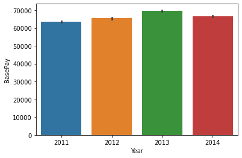

**Exploration Ideas**

1.How is the average salary has changed over years?

2.Comparing the TotalPay with each Job Title, then grouping the Job Title and get the max, min, and avg of TotalPay.

     Average change in BasePay over years       Average change in OvertimePay over years
         
